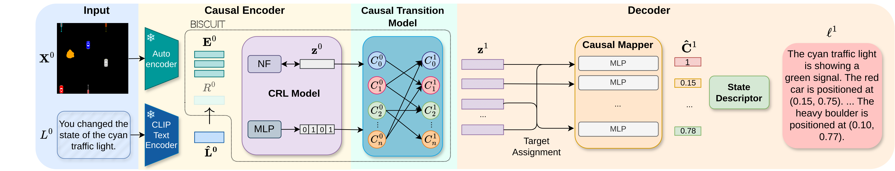

# Bridging LLMs and Causal World Models

This is the official code repository for the paper **"Language Agents Meet Causality -- Bridging LLMs and Causal World Models"**.

[Project Page](https://j0hngou.github.io/LLMCWM/)



**Figure 2:** Illustration of the first roll-out step with the Causal World Model. The image $\mathbf{X}^0$ and action description $L^0$ are encoded into initial latent representations. The CRL module then disentangles these representations, and the transition model predicts the next state. The causal mapper transforms the disentangled causal representation of the next state into the estimated causal variables $\mathbf{\hat{C}}^1$. Finally, the state descriptor $s$ generates a natural language description $\ell^1$ of the next state. For subsequent steps, the model can autoregress in the latent space using the previously predicted $\mathbf{z}$, bypassing the autoencoder and normalizing flow, enabling efficient multi-step inference and planning.

## Overview

We introduce a framework that integrates Causal Representation Learning (CRL) with Language Models (LLMs) to enable causally-aware reasoning and planning in interactive environments. Our approach builds a Causal World Model (CWM) that takes actions in text format and states in image format, producing state representations in natural language. By combining the structured causal understanding of CRL with the flexible interface of language models, our method demonstrates superior performance in causal inference and planning tasks across different environments.

This repository contains the code for reproducing the experiments and results presented in our paper.

## Requirements

The code was developed and tested with Python 3.8 and PyTorch 1.13. We recommend using conda to manage the environment.

## Setup Instructions

1. **Clone the repository:**
   ```bash
   git clone <repository_url>
   cd <repository_directory>
   ```

2. **Create a new conda environment:**
   ```bash
   conda env create -f environment.yaml
   ```

3. **Activate the environment:**
   ```bash
   conda activate causal_world_model
   ```

## Datasets

### Data Generation

We provide scripts to generate the datasets used in our experiments. The datasets can be generated for two environments: iTHOR and GridWorld.

#### iTHOR Environment

To generate the iTHOR dataset, run:

```bash
bash data_generation/parallel_generation_ithor.sh <dataset_name> <num_sequences>
```
- `<dataset_name>`: Name of the dataset (e.g., `ithor_dataset`)
- `<num_sequences>`: Number of sequences to generate (e.g., `1000`)

#### GridWorld Environment

To generate the GridWorld dataset, run:

```bash
python data_generation/data_generation_toy.py --dataset_name <dataset_name> --train_seeds <train_seeds> --val_seeds <val_seeds> --test_seeds <test_seeds> --pre_intervention_step
```
- `<dataset_name>`: Name of the dataset (e.g., `gridworld_dataset`)
- `<train_seeds>`: Number of seeds for the training split (default: `1000`)
- `<val_seeds>`: Number of seeds for the validation split (default: `100`)
- `<test_seeds>`: Number of seeds for the test split (default: `100`)

Optional Arguments:
- `--grid_x`: Number of grid cells in the x-axis (default: `8`)
- `--grid_y`: Number of grid cells in the y-axis (default: `8`)
- `--sprite_size`: Size of the grid sprites (default: `32`)
- `--fixed_light_positions`: List of fixed light positions (default: `None`)
- `--batch_size`: Batch size (default: `50`)
- `--pre_intervention_step`: If set, the intervention is applied before the step function is called.

### Processing Action Descriptions

After generating the datasets, process the action descriptions to get the tokenized text.

For **iTHOR**:
```bash
python data_generation/process_descriptions.py --data_dir <data_dir> --output_dir <output_dir>
```

For **GridWorld**:
```bash
python data_generation/process_toy_descriptions.py --data_dir <data_dir> --output_dir <output_dir>
```
- `<data_dir>`: Directory containing the raw dataset.
- `<output_dir>`: Directory to save the processed dataset.

## Training the CRL Modules

We forked the BISCUIT code and modified it to suit our needs.

### Training the Autoencoder

First, train the autoencoder using the generated datasets.

Sample command:
```bash
python experiments/train_ae.py --data_dir <data_dir> --batch_size 128 --c_hid 128 --lr 5e-4 --warmup 100 --num_latents 40 --max_epochs 250 --seed 42
```
- `<data_dir>`: Directory containing the dataset.
- Adjust `--batch_size`, `--c_hid`, and other hyperparameters as needed.

### Training the Normalizing Flow (CRL Module)

To train the CRL modules for various subsample percentages, with or without text-based action representations:

Sample command:
```bash
python experiments/train_nf.py --data_dir <data_dir> --autoencoder_checkpoint <ae_checkpoint> --num_latents 40 --c_hid 192 --num_flows 6 --lr 0.003 --num_samples 2 --batch_size 384 --warmup 100 --seed 42 --max_epochs 300 --text_encoder sentence_transformer --noise_level 0.02 --stop_grad --subsample_percentage <percentage> [--text] [--text_only]
```
- `<data_dir>`: Directory containing the dataset.
- `<ae_checkpoint>`: Path to the trained autoencoder checkpoint.
- `--subsample_percentage`: Percentage of data to use (e.g., `0.01` for 1%).
- `--text`: Include this flag to use hybrid action representations (HB).
- `--text_only`: Include this flag along with `--text` to use text-based action representations (TB).
- Omitting both `--text` and `--text_only` uses coordinate-based action representations (CB).

## Causal Mappers

We provide scripts to train and evaluate **causal mappers**, which are models that map the latent representations learned by the CRL module to the underlying causal variables. This allows for interpretable predictions and further analysis of the learned representations.

### Training Causal Mappers

To train the causal mappers, run the following command:

```bash
python causal_mappers_all.py --environment <environment> --data_folder <data_folder>
```

- `<environment>`: The environment to use, either `ithor` or `gridworld`.
- `<data_folder>`: Path to the data folder for the specified environment.

**Example:** To train causal mappers on the **GridWorld** environment:

```bash
python causal_mappers_all.py --environment gridworld --data_folder data/gridworld/
```

This script will train causal mappers for the specified environment and save the outputs (models, target assignments, plots) in the `causal_mappers_outputs_<environment>/` directory.

### Evaluating Causal Mappers

After training, you can evaluate the performance of the causal mappers by inspecting the Mean Absolute Error (MAE) plots generated in the output directory:

- `causal_mappers_outputs_<environment>/causal_mappers_mae_<environment>.png`

These plots show the MAE for each causal variable, allowing you to assess how well the causal mappers are predicting the underlying causal factors.

### Baseline Models

We also provide baseline models for comparison, which are multi-head MLPs trained to predict the causal variables directly from the latent representations without using the causal mapping structure.

To train the baseline models, the same script `causal_mappers_all.py` is used. The outputs are saved as:

- `causal_mappers_outputs_<environment>/baseline_model_mae_<environment>.png`

### Notes

- The causal mappers leverage the disentangled representations from the CRL module to predict causal variables.
- Training and evaluating the causal mappers helps validate the quality of the learned representations.
- Ensure that you have trained the CRL module before running the causal mappers script.

## Causal Reasoning and Planning Experiments

We forked the `llm-reasoners` repository and modified it for our experiments.

### Planning Experiments

From inside the `llm-reasoners` folder, run the following commands:

#### GridWorld Planning
```bash
python examples/gridworld/rap_biscuit_inference.py --base_lm exllamav2 --exllamav2_model_dir <model_dir> --exllamav2_lora_dir None --crl_model_path ../pretrained_models/gridworld_biscuit.ckpt --autoencoder_path ../pretrained_models/AE_gridworld/AE_40l_64hid.ckpt --causal_mapper_path causal_mappers_outputs_gridworld/causal_encoders_gridworld.pt --tokenizer_path sentence-transformers/all-MiniLM-L6-v2 --batch_size 4 --depth_limit 6 --w_exp 146.50120927222557 --data_path examples/gridworld/data/step_4.pth
```

#### iTHOR Planning
```bash
python examples/ithor/rap_ithor_inference.py --base_lm exllamav2 --exllamav2_model_dir <model_dir> --exllamav2_lora_dir None --crl_model_path ../pretrained_models/ithor_biscuit.ckpt --autoencoder_path ../pretrained_models/AE_iTHOR/AE_40l_64hid.ckpt --causal_mapper_path causal_mappers_outputs_ithor/causal_encoders_ithor.pt --tokenizer_path sentence-transformers/all-MiniLM-L6-v2 --batch_size 4 --depth_limit 6 --use_causal_wm False --w_exp 183.1059662028766 --prompt examples/ithor/prompts/prompt_4step.json --data_path examples/ithor/data/step_4_ws.pth --num_shot 9
```

Adjust the paths to match your environment and models.

### Causal Inference Experiments

From inside the `llm-reasoners` folder, run:

```bash
python examples/ithor/causal_inference_experiments.py
```

**Note:** This repository builds upon the codebases of [BISCUIT](https://github.com/phlippe/BISCUIT) and [llm-reasoners](https://github.com/maitrix-org/llm-reasoners), which we have forked and modified for our experiments.

## Fetching Pretrained Models

We provide a script to download and set up the pretrained models required for running the experiments.

### Fetching Models

To download the pretrained models, run:

```bash
cd pretrained_models
bash fetch_models.sh
```

This script will download the models archive from our hosting site and extract it into the appropriate directories.

### Hosting of Models

We host the pretrained models on **[zenodo.org](https://zenodo.org/records/13992827)** for reliable and free access.
